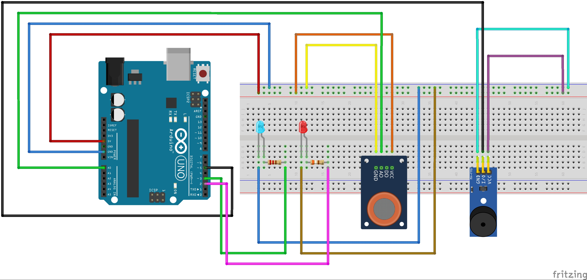
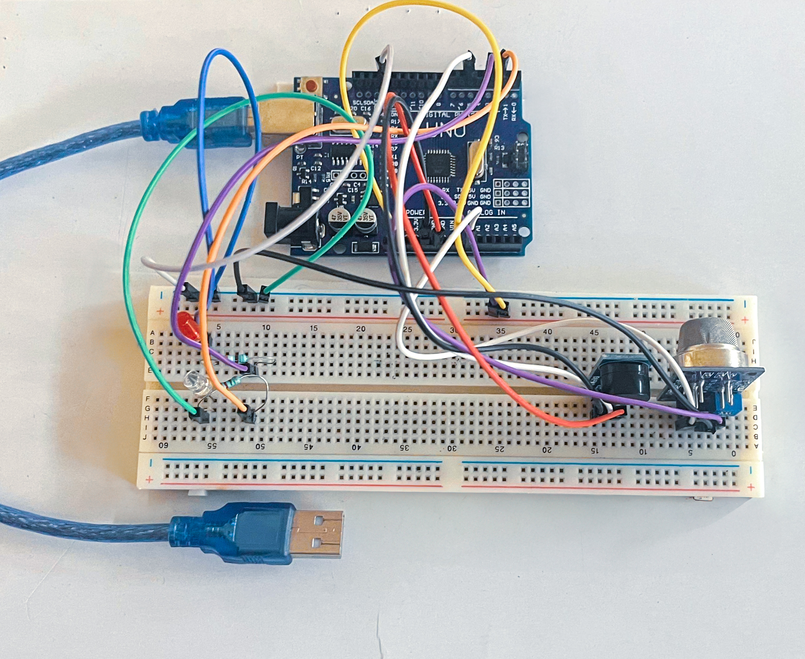

# IoT-Enabled Smoke Detection System Using Arduino

## 📌 Project Overview
An **IoT-enabled smoke detection system** developed using the MQ-135 gas sensor and Arduino UNO to monitor air quality in real-time and generate immediate alerts when hazardous smoke levels are detected. The system is designed to be low-cost, efficient, and easily adaptable for both residential and industrial safety applications.

## 🎯 Project Highlights
- ✅ **Designed and implemented an Arduino-based smoke detection system** utilizing the MQ-135 gas sensor to monitor air quality and detect hazardous smoke concentrations in real time.
- ✅ **Developed a threshold-based alert mechanism**, where the system triggers an active-high buzzer module when the smoke level surpasses a predefined safety limit, ensuring immediate hazard notification.
- ✅ **Optimized sensor calibration and sensitivity adjustments** using a voltage divider circuit, enhancing detection accuracy while reducing false positives.
- ✅ **Implemented real-time data acquisition and processing with Arduino**, ensuring low-latency response and high reliability.
- ✅ **Designed the system with low-power consumption strategies**, making it suitable for both industrial and residential safety applications.

## 🛠️ Components Used
- Arduino UNO
- MQ-135 Gas Sensor
- Buzzer Module
- LED Indicators (Red, Blue)
- Resistors (220Ω, 390Ω)
- Breadboard & Jumper Wires

## 📐 Specifications

### 📌 MQ-135 Gas Sensor
- **Operating Voltage:** 5V DC
- **Detectable Gases:** Ammonia (NH3), Benzene, Alcohol, Smoke, CO2, and other harmful gases
- **Analog Output Range:** 0 – 5V
- **Preheat Time:** ~24 hours for optimal accuracy
- **Typical Applications:** Air quality monitoring, gas leakage detection, pollution detection

### 📌 Active Buzzer Module
- **Operating Voltage:** 3.3V to 5V DC
- **Signal Type:** Active (built-in oscillator, just power on to sound)
- **Sound Level:** ~85dB at 10 cm distance
- **Current Consumption:** ~30mA
- **Usage:** Directly powered by Arduino digital pin (no additional circuitry required)

### 📌 Arduino UNO
- **Microcontroller:** ATmega328P
- **Operating Voltage:** 5V
- **Digital I/O Pins:** 14 (6 PWM outputs)
- **Analog Input Pins:** 6
- **Flash Memory:** 32 KB
- **SRAM:** 2 KB
- **EEPROM:** 1 KB
- **Clock Speed:** 16 MHz
- **Power Supply Options:** USB or external (7V-12V recommended)

## ⚙️ Circuit Setup

## 🖼️ Final Project Output

### 📸 Final Project Setup

### 📽️ Live Demo Video
[📺 Watch Project Demo on Google Drive](https://drive.google.com/file/d/1q_IVqRpabbkN38JdHxFjajuIb10Q2Nq1/view?usp=sharing)

You can also find the demo video inside this repository:  
- [`Project-Demo.mp4`](Project-Demo.mp4)

## 🖥️ Code Files
All code files are available inside the [`Smoke_Detector/`](Smoke_Detector/) directory:
- [`Smoke_Detector.ino`](Smoke_Detector/Smoke_Detector.ino) — Arduino sketch for uploading to the board.
- [`Smoke_Detector.txt`](Smoke_Detector/Smoke_Detector.txt) — Code in text format for quick viewing.

## 📄 How to Use
1. ✅ Connect the components according to the circuit diagram.
2. ✅ Upload the Arduino code using Arduino IDE.
3. ✅ Power up the circuit using USB or external battery.
4. ✅ The system monitors air quality in real-time.
5. ✅ When smoke crosses a set threshold, the buzzer and LED provide immediate alert.

## 🚀 Future Scope
- ✅ Integration of **Bluetooth (HC-05)** or **Wi-Fi (ESP8266/ESP32)** modules for **IoT-based remote monitoring** and mobile notifications.
- ✅ Addition of **GSM module (SIM800L/SIM900A)** for **SMS alerts and call notifications**, enabling instant mobile alerts without internet.
- ✅ Incorporation of **temperature and humidity sensors (DHT11/DHT22)** for expanded environmental monitoring.
- ✅ Development of a **mobile app** or **web dashboard** to visualize sensor readings and alerts.
- ✅ Implementation of **cloud-based data logging** for historical analysis and safety audits.

## 🧑‍💻 Author
**Argha Kumar Dhar ([argha-kumar-dhar](https://github.com/argha-kumar-dhar))**

## 📜 License
This project is open-source under the [MIT License](LICENSE).
